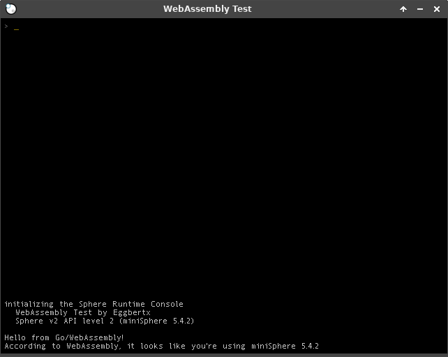

# neoSphere-wasmtest

I'm using this to test/experiment with WebAssembly support in neoSphere. It's currently very unstable and only works with WebAssembly files compiled in Go. Eventually I want to make it more flexible and compatible with any neoSphere compatible WebAssembly file. I'll also probably/eventually/maybe add Rust files to test that too.

Note that this requires [Emscripten](https://github.com/emscripten-core/emsdk), [Go](https://golang.org), and [neoSphere](https://github.com/spheredev/neosphere)

## Building
To see usage info, run `./build.sh help` in a Unix-like environment or `.\build.ps1` in PowerShell to see usage info.

## Screenshot
Here is a screenshot of it running a simple hello world program that gets some info from the Sphere API and shows it in the Console object.

